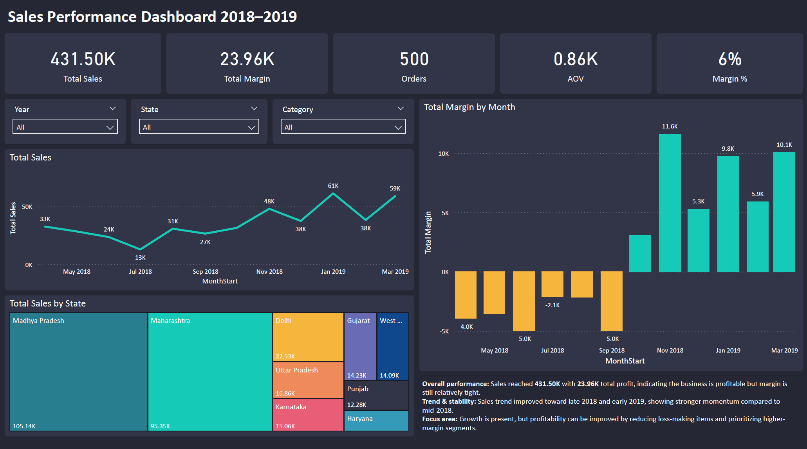
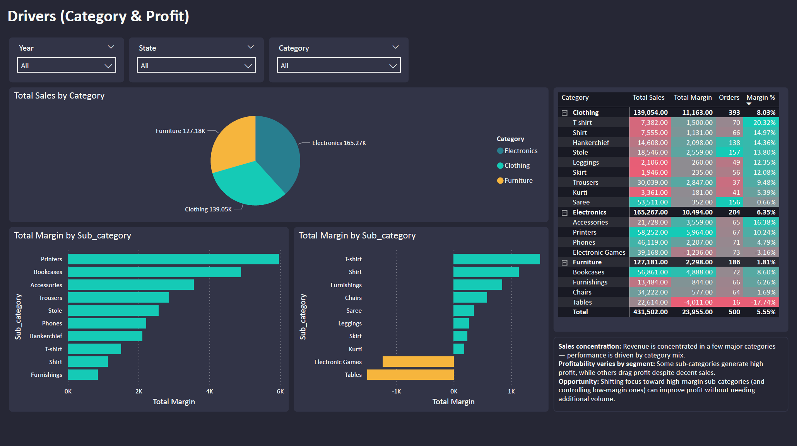
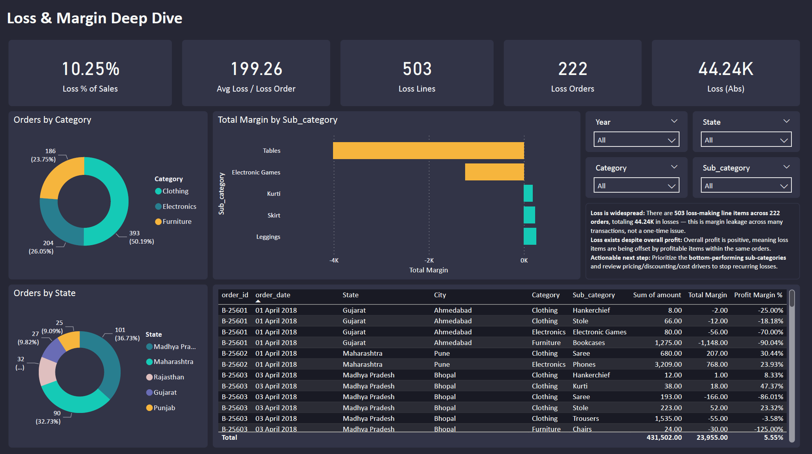
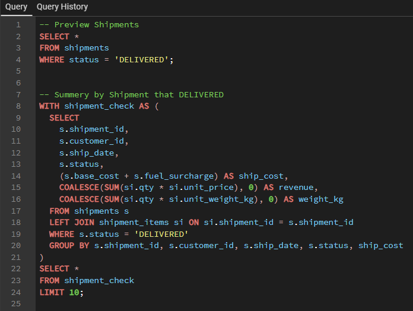
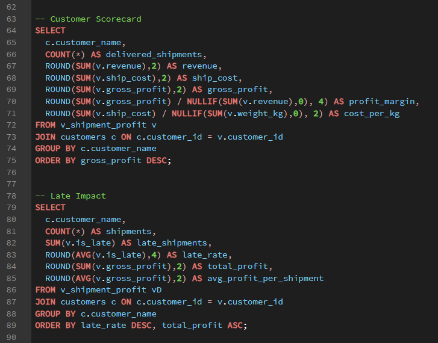
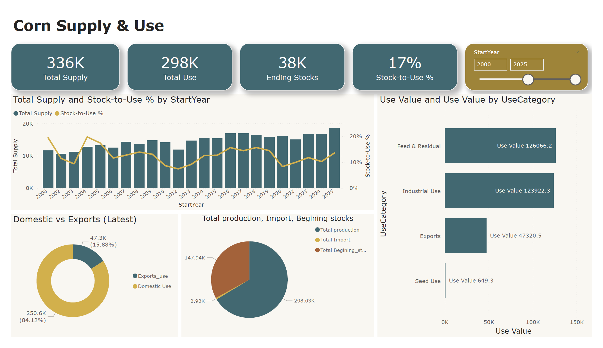
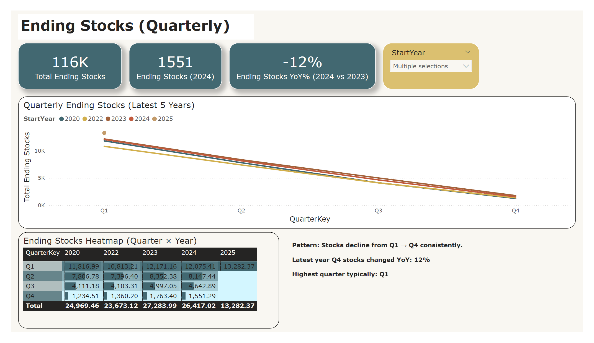
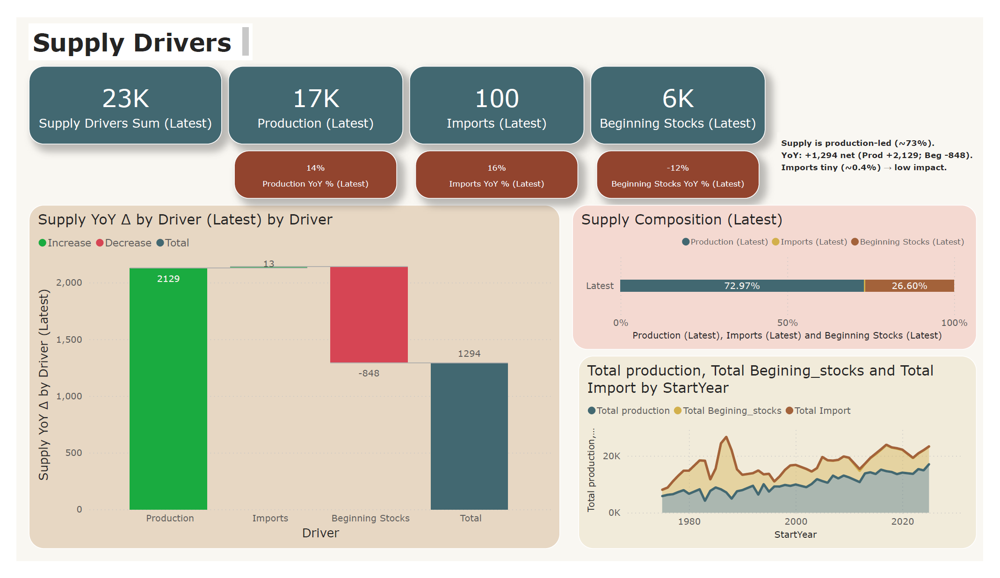

# Peerapol Udommalee — Data Analyst Portfolio

Live site: https://peerapoludommalee.github.io/

This repo hosts my portfolio website (GitHub Pages) showcasing SQL + Power BI projects with clear storytelling (Problem → Approach → Impact).

---

## Projects

### 1) Sales Performance Dashboard (Power BI + SQL)
**Problem:** Stakeholders need a fast, clear view of sales performance and profit drivers over time — and a way to spot margin leakage.  
**Approach:** Built a SQL order-item dataset + monthly KPI layer, then created Power BI views (Overview → Drivers → Loss Deep Dive).  
**Impact:** Faster decision-making with clear KPI tracking and actionable insights on where profit is being lost.

**Screenshots**
- Overview: 
- Drivers: 
- Loss & Margin Deep Dive: 

**Links**
- Dashboard file (Drive): https://drive.google.com/drive/folders/13CW7USVuTRvtlcCuV8QTMpbkP0w-WBNF?usp=drive_link

---

### 2) SQL Analysis: Customer Profitability (Logistics)
**Problem:** Identify profitable vs loss-making customers and explain the drivers behind profitability (cost, weight, service level).  
**Approach:** Built a shipment-level profitability view (revenue vs ship_cost), aggregated results into a customer scorecard, ranked top/bottom customers, and analyzed late delivery impact + monthly profit trend (window function).  
**Impact:** Highlighted loss drivers and recommended actions: repricing, minimum charge, and carrier/route optimization for high-risk lanes.

**Screenshots**
- Delivered Shipments & Shipment Summary: 
- Customer Scorecard: 

**Links**
- Case study PDF: https://drive.google.com/file/d/12rUsYnUN4nRyba3AC4yoYRaOBlHDbLTw/view?usp=drive_link

---

### 3) Power BI Dashboard: Corn Supply & Use (Market Analytics)
**Problem:** Business users need a clear view of corn supply-demand balance to understand market tightness (stocks), supply sources, and where usage is going.  
**Approach:** Built a Power BI dashboard with an executive overview + deep dives into supply drivers and ending stocks, using YoY comparisons, composition charts, and quarterly trend views.  
**Impact:** Faster market-read and decision support—users can quickly spot supply shifts, stock tightening/loosening, and demand mix changes without digging through raw tables.

**Screenshots**
- Overview: 
- Supply Drivers: 
- Ending Stocks: 

**Links**
- Dashboard file (Drive): https://drive.google.com/drive/folders/1vA-l2DE8E3OBhjyJmvlsULUFoataFZyi?usp=drive_link

---

## Tech
- GitHub Pages
- HTML/CSS/JavaScript
- Assets stored in `Assets/image/`

## Contact
- LinkedIn: https://www.linkedin.com/in/peerapol-udommalee-b5b089190/
- Email: peerapol.udommalee@gmail.com
