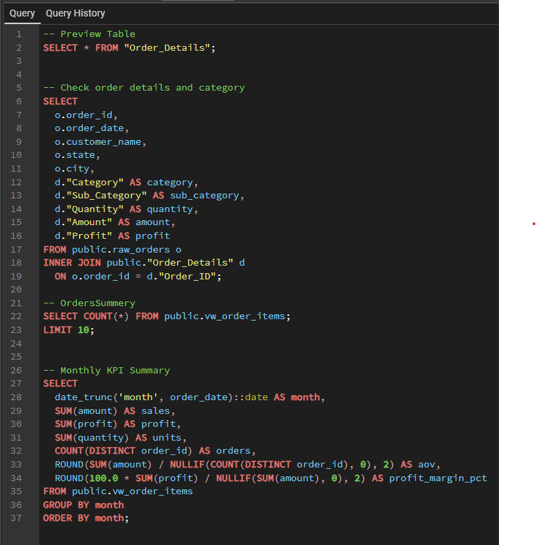

# SQL Project – Order & Monthly KPI Analysis

This project demonstrates SQL skills: joining order header + order details and generating monthly KPI summaries.

## What’s inside
- Join `raw_orders` + `Order_Details` to create an order-item dataset
- Monthly aggregation: Sales, Profit, Units, Orders, AOV, Profit Margin

## Key SQL Queries

### 1) Join Orders + Order Details + Monthly KPI Summary

## Metrics
- **Sales** = SUM(amount)
- **Profit** = SUM(profit)
- **Units** = SUM(quantity)
- **Orders** = COUNT(DISTINCT order_id)
- **AOV** = Sales / Orders
- **Profit Margin %** = (Profit / Sales) * 100# peerapoludommalee.github.io
